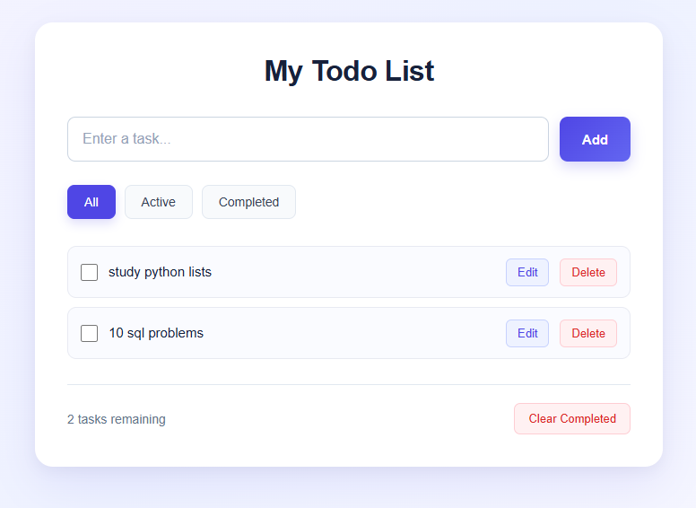

# Todo List

A simple and responsive Todo List web application built using HTML, CSS, and JavaScript.

The application allows users to create, edit, complete, delete, and filter tasks. Todos are stored in the browser using Local Storage, so tasks remain available after refreshing the page.

## Features

- Add new tasks
- Add tasks using the Enter key
- Edit existing tasks
- Mark tasks as completed
- Delete tasks
- Filter tasks:
  - All
  - Active
  - Completed
- Clear all completed tasks
- Display remaining task count
- Save tasks using Local Storage
- Responsive design for desktop and mobile

## Preview



## Technologies Used

- HTML5
- CSS3
- JavaScript
- Browser Local Storage

## Project Structure

```text
todo-list/
│
├── assets/
│   ├── icons/
│   └── images/
│
├── css/
│   └── style.css
│
├── js/
│   └── script.js
│
├── index.html
└── README.md